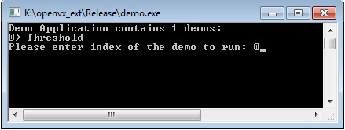
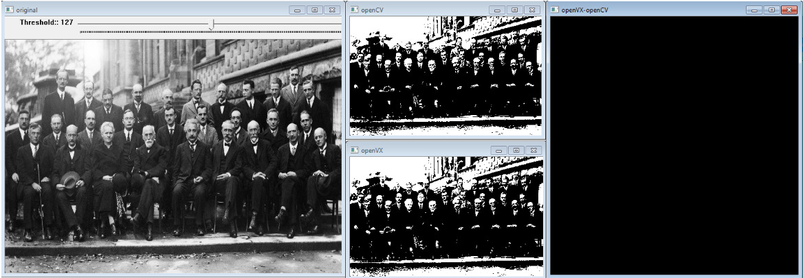
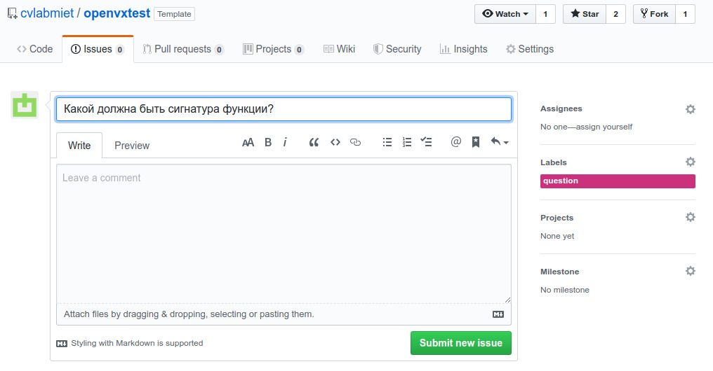

# Тестовые задания для студентов

Задания рассчитаны на студентов кафедр ВМ-1, ИПОВС, ВТ (2й-3й курс), интересующихся цифровой обработкой изображений и компьютерным зрением.

Реализовать одну или несколько функций, представленных в таблице:

№  | Алгоритм | Сложность
---|:---------|:---------:
1  | Connected Components Labeling | Normal
2  | Fourier Transform | Easy
3  | Moments | Easy
4  | Hu Moments | Easy
5  | Match Template | Easy
6  | Watershed Segmentation | Hard
7  | GrabCut Segmentation | Hard
8  | ViBe Motion Detection | Normal
9  | MOG Motion Detection (S&G) | Hard
10 | Find Contours | Easy
11 | Hough Lines | Normal
12 | Hough Circles | Normal
13 | Fit Ellipse | Normal
14 | Fit Line | Easy
15 | Curve Detector | Normal
16 | Approximate with Polyline | Easy
17 | Curve Flexure | Easy
18 | Convex Hull | Easy
19 | Convexity Defects | Easy
20 | HOG Detector | Hard
21 | Viola-Jones Detector | Hard
22 | [Stereo] Camera Calibration | Hard
23 | [Stereo] Disparity Map | Hard

# Предварительная настройка

1. Настоятельно рекомендуется использовать систему сборки CMake
1. Скачать Visual Studio 2019 Community Edition
1. Установить в систему OpenCV3:
    * склонировать репозиторий https://github.com/microsoft/vcpkg
    * проследовать инструкциям по установке из репозитория:
        * провести интеграцию с Visual Studio `.\vcpkg integrate install`
    * установить OpenCV3 командой `.\vcpkg install opencv3:x64-windows`

1. Склонировать репозиторий проекта
1. Запустить и проверить работу примера:

    

    После запуска демонстрационного примера для функции пороговой обработки должны быть показаны 4 окна:

    

    Левое - оригинальное изображение с трек баром для изменения порога.
    Средние - результаты работы OpenCV и OpenVX.
    Правое - абсолютная разность OpenCV и OpenVX.

# Задание

1. Необходимо использовать шаблон (`Use this template`) репозитория https://github.com/cvlabmiet/openvxtest
1. Необходимо предложить свою реализацию одной или нескольких функций из таблицы выше.
Для каждой из функций указана субъективная сложность реализации, поэтому рекомендуется сначала ознакомиться со всеми
функциями (см. [документ](https://drive.google.com/file/d/0B-3W-pT_6OLcRDJoUmZqalBHWVk/view?usp=sharing)).
1. О выбранной функции сообщаем путём заполнения
[таблицы](https://docs.google.com/spreadsheets/d/15XhyQxhv1i4mt2xPyi1T0HeMWq5tyukQe_yOzlPNPuk), указав ФИО напротив понравившейся задачи.
1. Функции необходимо реализовывать в проекте libopenvx - это должен быть отдельный файл для каждой функции.
Формат имени файла: `openvx_ext\Lib\Kernels\ref\ref_functionName.c`.
1. Объявление функции должно быть добавлено в `openvx_ext\Lib\Kernels\ref.h`
1. При реализации функции желательно использовать:
    * структуры данных, определённые в `openvx_ext\Lib\Common\types.h` (!не OpenCV!)
    * перечисления, определённые в `openvx_ext\Lib\Common\openvx\vx_types.h`

1. Для проверки корректности работы необходимо подготовить демонстрационный тест в проекте `demo`:
    * создать файл с именем `openvx_ext\Demo\Kernels\demo_functionName.cpp`
    * реализовать интерфейс `IDemoCase` для своего алгоритма и добавить функцию создания `DemoCase` в `openvx_ext\Demo\DemoEngine.h`

1. Демо-пример должен наглядно показывать работу вашей функции в сравнении с аналогичной функцией в OpenCV (при её наличии).
1. Возникающие вопросы можно задавать через Issue основного репозитория в github:

    

1. Окончательный результат работы должен быть оформлен в виде pull request в **свой** репозиторий.
В таблицу из пункта 1 добавляется ссылка на сделанный pull request.
