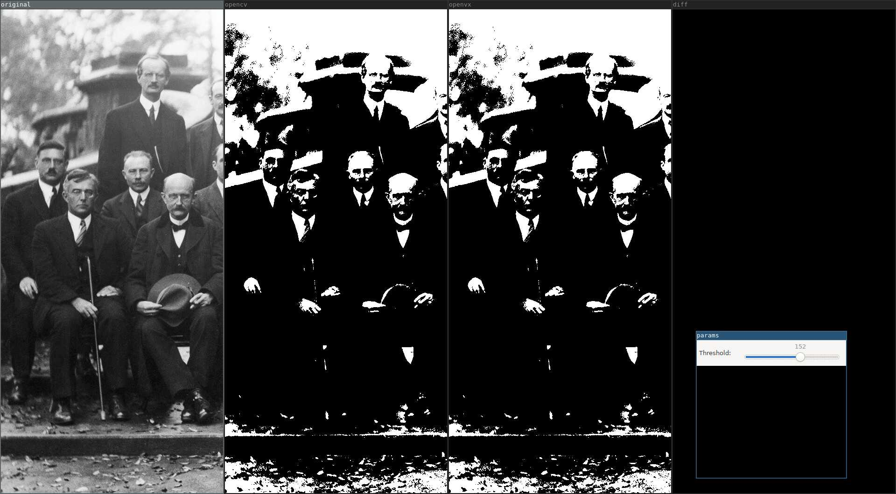

# Тестовые задания для студентов

Задания рассчитаны на студентов 2й-4й курс, интересующихся цифровой обработкой изображений и компьютерным зрением.

Реализовать одну или несколько функций, представленных в таблице:

№  | Алгоритм | Сложность
---|:---------|:---------:
1  | Connected Components Labeling | Normal
2  | Fourier Transform | Easy
3  | Moments | Easy
4  | Hu Moments | Easy
5  | Match Template | Easy
6  | Watershed Segmentation | Hard
7  | GrabCut Segmentation | Hard
8  | ViBe Motion Detection | Normal
9  | MOG Motion Detection (S&G) | Hard
10 | Find Contours | Easy
11 | Hough Lines | Normal
12 | Hough Circles | Normal
13 | Fit Ellipse | Normal
14 | Fit Line | Easy
15 | Curve Detector | Normal
16 | Approximate with Polyline | Easy
17 | Curve Flexure | Easy
18 | Convex Hull | Easy
19 | Convexity Defects | Easy
20 | HOG Detector | Hard
21 | Viola-Jones Detector | Hard
22 | [Stereo] Camera Calibration | Hard
23 | [Stereo] Disparity Map | Hard

# Предварительная настройка

1. Используется система сборки CMake
1. Скачать Visual Studio 2019 Community Edition (или выше)
1. Установить в систему OpenCV4:
    * склонировать репозиторий https://github.com/microsoft/vcpkg
    * проследовать инструкциям по установке из репозитория:
        * провести интеграцию с Visual Studio `.\vcpkg integrate install`
    * установить OpenCV4 командой `.\vcpkg install opencv4:x64-windows`

1. Склонировать репозиторий проекта
1. Запустить и проверить работу примера:

    ```
    $ demo/demo
    Demo Application contains 1 demos:
    0) threshold
    Please enter index of the demo to run: 0
    Press Enter or Spacebar to apply parameters. Press Esc to exit...
    ```

    После запуска демонстрационного примера для функции пороговой обработки должны быть показаны 5 окон:

    

    1. Оригинальное изображение.
    1. Результат работы OpenCV.
    1. Результат работы OpenVX.
    1. Абсолютная разность OpenCV и OpenVX.
    1. Трекбар для изменения порога (необходимо нажать клавишу Enter или пробел для обновления параметров на изображениях).

# Задание

1. Необходимо использовать шаблон (`Use this template`) репозитория https://github.com/cvlabmiet/openvxtest.
1. Необходимо предложить свою реализацию одной или нескольких функций из таблицы выше.
Для каждой из функций указана субъективная сложность реализации, поэтому рекомендуется сначала ознакомиться со всеми
функциями (см. [документ](https://drive.google.com/file/d/0B-3W-pT_6OLcRDJoUmZqalBHWVk/view?usp=sharing&resourcekey=0-OzXBpTczqFuOdXWcyEDHsQ))
1. О выбранной функции сообщаем путём заполнения
[таблицы](https://docs.google.com/spreadsheets/d/15XhyQxhv1i4mt2xPyi1T0HeMWq5tyukQe_yOzlPNPuk), указав ФИО напротив понравившейся задачи.
1. Функции необходимо реализовывать в директории `kernels/src/`.
Реализация возможна на языке C или C++ (язык выбирается по расширению файла).
1. Объявление функции должно быть добавлено в `kernels/include/kernels.h`.
1. При реализации функции желательно использовать:
    * структуры данных, определённые в `kernels/include/detail/types.h` (!не OpenCV!);
    * перечисления, определённые в `kernels/include/openvx/vx_types.h`.

1. Для проверки корректности работы необходимо подготовить демонстрационный пример в проекте `demo`:
    * создать файл с именем `demo/src/demo_funcname.cpp` (`funcname` - имя реализуемой функции);
    * выбрать изображение из директории `image/` на котором будет показано демо;
    * реализовать интерфейс `idemo` для своего алгоритма и в конце файла создать экземпляр класса;
    * реализовать необходимые методы для своего алгоритма и аналогичного из OpenCV.

1. Демо-пример должен **наглядно** показывать работу вашей функции в сравнении с аналогичной функцией из OpenCV (при её наличии).
1. Возникающие вопросы можно задавать через issue основного репозитория в github:

    

1. Окончательный результат работы должен быть оформлен в виде pull request в **свой** репозиторий.
В таблицу из пункта 1 добавляется ссылка на сделанный pull request.
